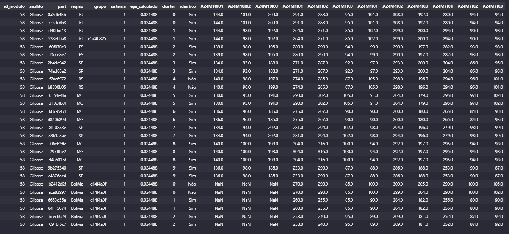
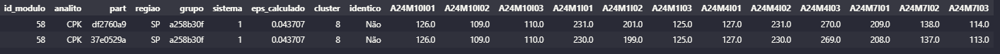
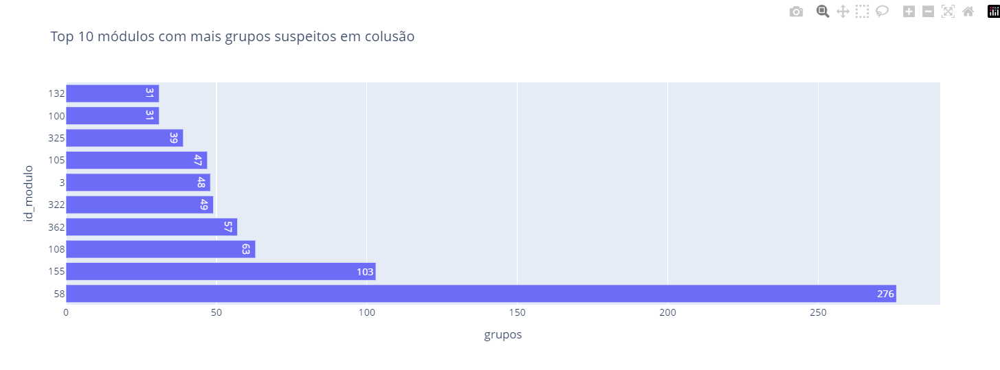

# Estudo de Colusão

#### Aluno: Bruno Cavalcanti de Souto Santos

#### Orientador: Felipe Borges.

---

Trabalho apresentado ao curso [BI MASTER](https://ica.ele.puc-rio.br/cursos/mba-bi-master/) como pré-requisito para conclusão de curso e obtenção de crédito na disciplina "Projetos de Sistemas Inteligentes de Apoio à Decisão".

---

### Resumo

Este projeto propõe o desenvolvimento de um algoritmo de clusterização para identificação de possíveis casos de colusão no Ensaio de Proficiência laboratorial. Esta prática ocorre quando laboratórios reportam intencionalmente seus resultados de forma semelhante, o que compromete a estatística dos grupos de avaliação. Com base na extração de dados reportados em um ano cumulativo, foram realizadas tratativas no pré-processamento, e o algoritmo DBScan foi o mais eficaz para agrupar participantes suspeitos. O objetivo da detecção de conluios é trazer maior confiabilidade na obtenção do valor designado das amostras, garantindo maior robustez e justiça no processo de avaliação do Controle Externo da Qualidade.

### Abstract

This project proposes the development of a clustering algorithm to identify potential cases of collusion in laboratory Proficiency Testing. This practice occurs when laboratories intentionally report similar results, which compromises the statistical integrity of the evaluation groups. Based on the extraction of cumulative data reported over one year, preprocessing steps were applied, and the DBScan algorithm proved to be the most effective in grouping suspicious participants. The goal of detecting collusion is to ensure greater reliability in determining the assigned value of the samples, thus providing more robustness and fairness in the External Quality Assessment process.

### 1. Introdução

A [Controllab ](https://controllab.com/)é um provedor de Controle de Qualidade laboratorial, oferecendo soluções para garantir a confiabilidade dos resultados analíticos. Uma das formas de controle é a participação contínua do Ensaio de Proficiência, também conhecido como Controle Externo da Qualidade (CEQ). Esse programa permite que laboratórios avaliem seu desempenho por meio da comparação de seus resultados com os de outros participantes.

Nos exames quantitativos, uma das formas de obtenção do valor designado da amostra é utilizando o consenso entre os participantes. A partir dos dados reportados, estatísticas são calculadas para cada grupo de avaliação, evitando a interferência de valores discrepantes.

No entanto, um desafio crítico é a possibilidade de conluio entre laboratórios. Quando participantes ajustam intencionalmente seus resultados para ficarem próximos uns dos outros, pode gerar distorções nas avaliações, uma vez que muitos resultados iguais ou similares pode alterar significativamente o cálculo da concentração do material. Esse comportamento não apenas mascara possíveis falhas nos processos internos dos laboratórios envolvidos, mas também pode impactar negativamente outros participantes que reportam seus resultados de forma legítima, já que ocorre um deslocamento da média do grupo, o que influencia os limites de aceitação.

Diante desse problema, esse projeto propõe o desenvolvimento de um algoritmo de clusterização capaz de identificar resultados sistematicamente similares entre participantes. A ideia é detectar grupos suspeitos de conluio, permitindo que tal atividade não interfira na obtenção do valor designado, o que garante maior confiabilidade no Ensaio de Proficiência e assegura que todos os laboratórios sejam avaliados de forma justa.

### 2. Modelagem

O estudo de colusão deve ser feito por módulo e analito. Um módulo é definido como um conjunto de analitos comercializados pela empresa. O Ensaio de Proficiência geralmente é dividido em 4 rodadas por ano, cada  uma contendo 3 itens para análise laboratorial, totalizando 12 frascos de cada analito por ano. O objetivo desse projeto é identificar possíveis colusões entre participantes ao longo de um ano de reportes.

Dado que o desafio é agrupar dados e trata-se de uma modelagem não supervisionada, optou-se por um modelo de clusterização. Os dados foram extraídos do Data Warehouse via SQL e passaram por um pré-processamento. Para que cada participante fosse representado por linha, com as colunas correspondendo aos dados imputados, os dados foram pivotados. Além disso, aplicou-se um filtro para manter apenas participantes com no mínimo 60% de participação. Os valores faltantes foram preenchidos pela média da linha, pois espera-se que participantes com resultados rotineiramente próximos apresentem médias parecidas entre si. Para normalização dos dados utilizou-se o StandardScaler.

Após diversas tentativas, o DBScan demostrou ser o algortimo mais adequado para agrupar os dados. A maior dificuldade foi determinar o valor ótimo para o parâmetro EPS. Se o valor for muito alto, o algoritmo pode recomendar vários participantes em conluio, incluindo casos sem evidências suficientes. Se for muito baixo, apenas colas idênticas são encontradas. Como a verificação dos grupos em colusão exige verificação manual, analisando a natureza do ensaio, a localização geográfica dos participantes envolvidos e se são do mesmo grupo empresarial, é essencial que o modelo identifique apenas casos altamente confiáveis. Caso contrário, um volume alto de falsos positivos pode gerar demandas desnecessárias para outros setores da empresa. Observa-se que colusões geralmente são idênticas ou com pequenas variações, tipicamente de uma ou duas casas decimais.

Para encontrar de forma automatizada o valor para o eps, foi utilizada a técnica do k-Neares Neighbors, que analisa a distâmcia média entre os pontos mais próximos. Entretanto, para alguns exames os filtros aplicados dificultam a definição de um valor. Nesses casos, foi estabelecido o valor padrão eps = 0,02, garantindo que, ao menos, o modelo vá encontrar colusões idênticas, sem prejudicar o estudo.

Além disso, foi desenvolvida uma interface gráfica utilizando o Streamlit, permitindo ao usuário realizar estudos especificando módulos e analitos de forma dinâmica. Contudo, a execução do estudo para todos os módulos e analitos de um ano cumulativo demanda grande capacidade de processamento, o que pode comprometer a aplicação web. Para mitigar esse problema, existe uma versão do script que retorna os dados via dicionário Python, facilitando a exportação para planilhas Excel para análises complementares.

### 3. Resultados

O conjunto de dados de 2024 é composto por 1.426.101 dados, onde foram investigados 3.690 participantes que responderam 1.376 exames, distribuídos em 329 módulos. O tempo de processamento do algoritmo de clusterização DBScan para realizar todo o estudo foi em média 1 minuto e 20 segundos.

Dos 329 módulos analisados, foram identificados possíveis conluios em 291 deles, o que mostra a abrangência do modelo aplicado. Um dos desafios foi a determinação automática do parâmetro eps via k-Neares Neighbors. Em 27% dos exames, a técnica não conseguiu identificar um valor adequado, levando a adoção do valor fixo  de eps = 0,02, conforme definido na metodologia. Ao final da análise, 52% dos exames apresentaram pelo menos um grupo com suspeita de colusão. Destes, 12% identificaram colas idênticas, o que reforça a importância de se investigar esses casos com maior profundidade. No total, foram formados 1.570 grupos suspeitos. A localização do laboratório (unidade federativa ou país dependendo da nacionalidade)  e o grupo empresarial (caso haja) foram informações adicionais para auxiliar na tomada de decisão final.

A imagem acima mostra o exemplo do id_modulo 58 para o analito Glicose, onde 12 grupos foram encontrados, sendo 1 deste apresentando cola não idêntica: o cluster 4 é composto por participantes do mesmo Estado brasileiro e ambos não pertencem a nenhum grupo empresarial, o que pode ser indício de tentativa de disfarce por parte dos participantes. O número de participação e o nome do grupo empresarial foi codificado para essa apresentação.

Já para o analito CPK, o modelo encontrou colusão não idêntica entre dois participantes do mesmo Estado e grupo empresarial. Note que 6 itens não idênticos apresentam resultados similares, inclusive o participante da primeira linha apresenta constantemente resultados ligeriamente superiores (0,01 ou 0,02 a mais que o segundo participante), o que pode ser mais um indício de tentativa de padronização dos resultados entre as partes.

Exemplo de módulos analisados pela interface gráfica criada pelo Streamlit, também com participantes e grupos codificados. Note que o cluster 4 para o ensaio Albumina apresenta um cluster não idêntico, mas com participantes de Estados e grupos empresariais distintos.

Para priorização de módulos para investigação manual, a gráfico de barras acima evidencia os 10 módulos que tiveram mais clusters (grupos suspeitos) encontrados.

Vale destacar que, embora a presença de valores similares entre participantes seja forte indício de conluio, isso não implica necessariamente fraude, pois pode havar justificativas técnicas ou características do material analisado que expliquem a semelhança. Idealmente, exames cuja natureza não permite inferência por similaridade deveriam ser excluídos do estudo, mas no momento essas informações ainda não foram mapeadas e disponibilizadas.

### 4. Conclusões

Este estudo propôs uma abordagem baseada em modelagem não supervisionada, utilizando o DBScan para identificação de possíveis colusões entre participantes nos programas de Ensaio de Proficiência da Controllab. A metodologia desenvolvida demonstrou eficiência na detencção de padrões suspeitos, considerando tanto colusões idênticas quanto similares. O pré processamento foi essencial na qualidade dos resultados, exigindo participação mínima no ano cumulativo, substituição de valores faltantes e normalização dos dados. A detecção automática do parâmetro eps proporcionou maior precisão e versatilidade na automação, mesmo que em 27% dos casos tenha sido necessário utilizar um valor padrão para garantir que grupos pudessem ser encontrados.

Houve a tentativa de fazer o estudo utilizando o K-Means, porém sem sucesso já que não é possível definir o número de clusters de forma prévia (parâmetro necessário para esse modelo). Também foi de interesse colocar a região e grupo empresarial como critérios para a clusterização, utilizando o conceito de colunas dummys. Porém, notou-se perda de capacidade para identifação dos grupos em conluio, o que dificultou sua aplicação.

Os resultados presentes nesse arquivo revelam potencial aplicação desse estudo na rotina da empresa, dando suporte às atividades de auditoria e garantia da integridade das avaliações laboratoriais do controle externo da qualidade. O modelo se mostrou sensível tanto para resultados idênticos quanto para casos com pequenas variações, o que amplia sua aplicação em diferentes contextos de exames.

Contudo, o estudo revelou limitações, como a necessidade de informações adicionais sobre quais analitos de fato precisam e devem ser investigados, para mitigar a quantidade de falso positivo decorrente das características do material. Como próximos passos, recomenda-se:

* Listagem prévia de analitos recomendados para identificação de colusão;
* Otimização de tempo para processamento do algoritmo;

* Incorporar região e grupo como critérios para clusterização;
* O desenvolvimento de filtros de priorização automática, com base em características como a repetição de participantes em múltiplos clusters;

A metodologia proposta representa uma contribuição relevante para o monitoramento de possíveis colusões em Ensaios de Proficiência, oferecendo ganhos de eficiência e confiabilidade no processo de análise. O estudo está de acordo com as diretrizes da empresa, que procura contribuir para melhorar e garantir a qualidade das análises laboratorias do Brasil e do mundo.

---

Matrícula: 231.100.069

Pontifícia Universidade Católica do Rio de Janeiro

Curso de Pós Graduação *Business Intelligence Master*
