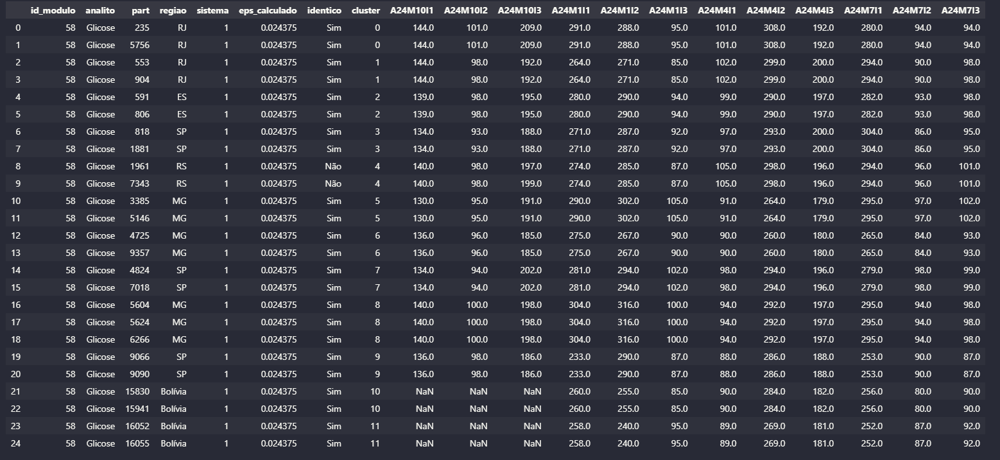
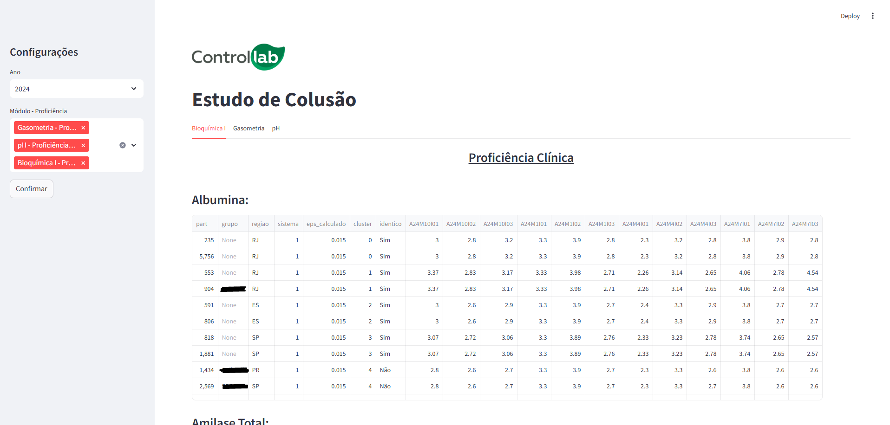

# Estudo de Colusão

#### Aluno: Bruno Cavalcanti de Souto Santos

#### Orientador: Felipe Borges.

---

Trabalho apresentado ao curso [BI MASTER](https://ica.ele.puc-rio.br/cursos/mba-bi-master/) como pré-requisito para conclusão de curso e obtenção de crédito na disciplina "Projetos de Sistemas Inteligentes de Apoio à Decisão".

---

### Resumo

Este projeto propõe o desenvolvimento de um algoritmo de clusterização para identificação de possíveis casos de colusão no Ensaio de Proficiência laboratorial. Esta prática ocorre quando laboratórios reportam intencionalmente seus resultados de forma semelhante, o que compromete a estatística dos grupos de avaliação. Com base na extração de dados reportados em um ano cumulativo, foram realizadas tratativas no pré-processamento, e o algoritmo DBScan foi o mais eficaz para agrupar participantes suspeitos. O objetivo da detecção de conluios é trazer maior confiabilidade na obtenção do valor designado das amostras, garantindo maior robustez e justiça no processo de avaliação do Controle Externo da Qualidade.

### Abstract

This project proposes the development of a clustering algorithm to identify potential cases of collusion in laboratory Proficiency Testing. This practice occurs when laboratories intentionally report similar results, which compromises the statistical integrity of the evaluation groups. Based on the extraction of cumulative data reported over one year, preprocessing steps were applied, and the DBScan algorithm proved to be the most effective in grouping suspicious participants. The goal of detecting collusion is to ensure greater reliability in determining the assigned value of the samples, thus providing more robustness and fairness in the External Quality Assessment process.

### 1. Introdução

A [Controllab ](https://controllab.com/)é um provedor de Controle de Qualidade laboratorial, oferecendo soluções para garantir a confiabilidade dos resultados analíticos. Uma das formas de controle é a participação contínua do Ensaio de Proficiência, também conhecido como Controle Externo da Qualidade (CEQ). Esse programa permite que laboratórios avaliem seu desempenho por meio da comparação de seus resultados com os de outros participantes.

Nos exames quantitativos, uma das formas de obtenção do valor designado da amostra é utilizando o consenso entre os participantes. A partir dos dados reportados, estatísticas são calculadas para cada grupo de avaliação, evitando a interferência de valores discrepantes.

No entanto, um desafio crítico é a possibilidade de conluio entre laboratórios. Quando participantes ajustam intencionalmente seus resultados para ficarem próximos uns dos outros, pode gerar distorções nas avaliações, uma vez que muitos resultados iguais ou similares pode alterar significativamente o cálculo da concentração do material. Esse comportamento não apenas mascara possíveis falhas nos processos internos dos laboratórios envolvidos, mas também pode impactar negativamente outros participantes que reportam seus resultados de forma legítima, já que ocorre um deslocamento da média do grupo, o que influencia os limites de aceitação.

Diante desse problema, esse projeto propõe o desenvolvimento de um algoritmo de clusterização capaz de identificar resultados sistematicamente similares entre participantes. A ideia é detectar grupos suspeitos de conluio, permitindo que tal atividade não interfira na obtenção do valor designado, o que garante maior confiabilidade no Ensaio de Proficiência e assegura que todos os laboratórios sejam avaliados de forma justa.

### 2. Modelagem

O estudo de colusão deve ser feito por módulo e analito. Um módulo é definido como um conjunto de analitos comercializados pela empresa. O Ensaio de Proficiência geralmente é dividido em 4 rodadas por ano, cada  uma contendo 3 itens para análise laboratorial, totalizando 12 frascos de cada analito por ano. O objetivo desse projeto é identificar possíveis colusões entre participantes ao longo de um ano de reportes.

Dado que o desafio é agrupar dados e trata-se de uma modelagem não supervisionada, optou-se por um modelo de clusterização. Os dados foram extraídos do Data Warehouse via SQL e passaram por um pré-processamento. Para que cada participante fosse representado por linha, com as colunas correspondendo aos dados imputados, os dados foram pivotados. Além disso, aplicou-se um filtro para manter apenas participantes com no mínimo 60% de participação. Os valores faltantes foram preenchidos pela média da linha, pois espera-se que participantes com resultados rotineiramente próximos apresentem médias parecidas entre si. Para normalização dos dados utilizou-se o StandardScaler.

Após diversas tentativas, o DBScan demostrou ser o algortimo mais adequado para agrupar os dados. A maior dificuldade foi determinar o valor ótimo para o parâmetro EPS. Se o valor for muito alto, o algoritmo pode recomendar vários participantes em conluio, incluindo casos sem evidências suficientes. Se for muito baixo, apenas colas idênticas são encontradas. Como a verificação dos grupos em colusão exige verificação manual, analisando a natureza do ensaio, a localização geográfica dos participantes envolvidos e se são do mesmo grupo empresarial, é essencial que o modelo identifique apenas casos altamente confiáveis. Caso contrário, um volume alto de falsos positivos pode gerar demandas desnecessárias para outros setores da empresa. Observa-se que colusões geralmente são idênticas ou com pequenas variações, tipicamente de uma ou duas casas decimais.

Para encontrar de forma automatizada o valor para o eps, foi utilizada a técnica do k-Neares Neighbors, que analisa a distâmcia média entre os pontos mais próximos. Entretanto, para alguns exames os filtros aplicados dificultam a definição de um valor. Nesses casos, foi estabelecido o valor padrão eps = 0,02, garantindo que, ao menos, o modelo vá encontrar colusões idênticas, sem prejudicar o estudo.

Além disso, foi desenvolvida uma interface gráfica utilizando o Streamlit, permitindo ao usuário realizar estudos especificando módulos e analitos de forma dinâmica. Contudo, a execução do estudo para todos os módulos e analitos de um ano cumulativo demanda grande capacidade de processamento, o que pode comprometer a aplicação web. Para mitigar esse problema, existe uma versão do script que retorna os dados via dicionário Python, facilitando a exportação para planilhas Excel para análises complementares.

### 3. Resultados

- 1376 exames rodados em 2024, levando em média 1 min e 15 segundos.
- 329 módulos buscados. Encontrado colas em 291
- 370 exames (27%) não encontraram eps via knn. Imputado para 0.02 (garante que pelo menos idêntico vai pegar)
- 711 exames  (52%) encontrados grupo(s) com suspeitos de colusão. Destes, 86 (12%) encontraram colas idênticas
- Foram identificados 1570 grupos de colusão em 329 módulos / 1376 exames.
- 15847 casos de encontrados no algoritmo, sendo destes 710 colas idênticas
- Lembrando que nem sempre identico quer dizer cola... depende da natureza do material. O certo seria excluir os analitos que não precisam ser analisados, mas no momento não tenho essa informação.
- Exemplo Bioquímica Glicose com 12 clusters encontrados, sendo 1 desse composto por colas não idênticas

  

  

  
- Priorizar módulos para investigação manual.

### 4. Conclusões

---

Matrícula: 231.100.069

Pontifícia Universidade Católica do Rio de Janeiro

Curso de Pós Graduação *Business Intelligence Master*
